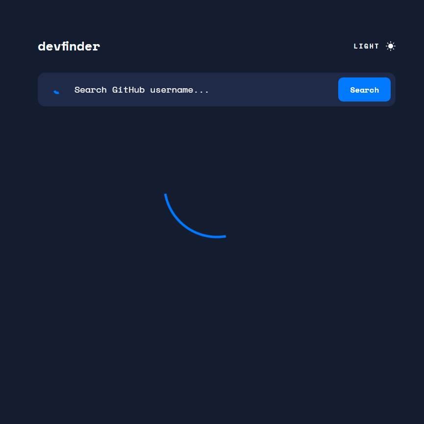

# Github User Search SPA

<div align="center"></div>

Design, assets, and requirements provided thanks to [FrontEnd Mentor](https://www.frontendmentor.io/challenges/github-user-search-app-Q09YOgaH6).

The project challenge was to create a functional Github user search application using the GitHub API that displayed infomration about the target user such as profile bio, username, account creation date, profile stats, and more. An inital attempt of this challenge was built and exists in the `Version1.0` branch of this repository, but I saw some aspects of the application that could be improved and decided to rebuild the application from scratch.

[Live Demo]()

## Techstack

This project was bootstrapped with [Vite](https://vitejs.dev/guide/) using the the React/Typescript template. The project is linted with [ESLint](https://eslint.org/docs/latest/user-guide/getting-started) using react, prettier, cypress, and the [jsx-a11y](https://github.com/jsx-eslint/eslint-plugin-jsx-a11y) rules.

Some of the tools used in this project include:

- [React](https://reactjs.org/), a JavaScript library for building user interfaces.
- [Typescript](https://www.typescriptlang.org/), a typed superset of JavaScript that compiles to plain JavaScript.
- [Cypress](https://www.cypress.io/), a JavaScript end-to-end testing framework.
- [SWR](https://swr.vercel.app/), a React Hooks library for remote data fetching.

The [axios library](https://axios-http.com/) is a promise-based HTTP client used to make requests to the GitHub API on behalf of the SWR hook (more on this later). The application is styled using [CSS Modules](https://github.com/css-modules/css-modules) with a color theme implemented along with a focus on responsive design.

## Insallation and Usage

To run the application locally, please follow the steps below:

1. Ensure that [Git](https://git-scm.com/) is installed on your machine and in the target directory run the `git clone https://github.com/JorgeAMendoza/github-user-search-app` command.
2. Navigate to the project directory with `cd github-user-search-app` and run the `npm install` command to install the project dependencies.
3. Run the `npm run dev` command to start the development server. The application will be running on `localhost:3000`.

To run the application in the production environment, run `npm run build` to build the application and then run `npm run preview` to preview the application on `localhost:3000`.

## Development

This section covers the development process of the application along with the decisions and changes made from the initial version.

### Initial Version

The original version of the application was bootstrapped using the [Create React App](https://create-react-app.dev/) tool using just JavaScript and the axios library. As I continued my learning for front-end development, my new found knowledge of TypeScript, testing practices, and continous integration led me to return to this application and challenge myself to rebuild it from scratch.

Some of the goals I set for myself were to:

1. Implement TypeScript to improve the development experience and reduce the number of runtime errors.
2. Implement a testing framework to ensure that the application is working as intended when deployed.
3. Implement a continous integration pipeline to automate the testing, linting, type-checking, and deployment processes.

### SWR and the GitHub API

Version 1.0 of the application simply used the useEffect to initally call the function [`get-github-info.js`](https://github.com/JorgeAMendoza/github-user-search-app/blob/version1.0/src/app/api/get-github-info.js#L3) which made the call to the GitHub API. See the [`GitHubSearch`](https://github.com/JorgeAMendoza/github-user-search-app/blob/version1.0/src/app/components/GitHubSearch.js) component below:

```javascript
export const GitHubSearch = () => {
  const [search, setSearch] = useState('');
  const [errorText, setErrorText] = useState('');
  const [userData, setUserData] = useState({});

  useEffect(() => {
    searchUser('octocat');
  }, []);

  async function searchUser(username) {
    try {
      const results = await getGithubInfo(username);
      setUserData(Object.assign({}, results));
    } catch (e) {
      setErrorText('No Results');
    }
  }

  return (
    <main>
      <Container>
        <SearchBar
          autoComplete="off"
          onSubmit={(e) => {
            e.preventDefault();
            if (!search) {
              setErrorText('Invalid Search');
              return;
            }
            setErrorText('');
            searchUser(search);
          }}
        >
    ...
    <Container/>
    <main>
  )
}
```

Three sets of state are used to set the user search, the user information, and the error information. This did work, however I believed that there were other solutions that allowed me to do the same thing along with other features such as caching and revalidation, which is what led me to use the SWR library.

In the updated version of the application, the component `App.tsx` now is the source where user infomration is fetched:

```typescript
function App() {
  const [user, setUser] = useState('octocat');
  const { data, error, isLoading } = useSWR<FetchResponse, Error>(
    user,
    fetchUserData,
    {
      keepPreviousData: true,
      revalidateOnFocus: false,
      revalidateOnReconnect: false,
      errorRetryCount: 0,
    }
  );

  return (
    <main className={styled.container}>
      <div className={styled.header}>
        <h1>devfinder</h1>
        <ThemeSwitch />
      </div>

      <SearchBar setUsername={setUser} loading={isLoading} error={error} />
      {data === undefined ? (
        <div className={styled.loadingSpinner}></div>
      ) : null}
      {data ? <UserDisplay userInfo={data} /> : null}
    </main>
  );
}
```

The `useSWR` hook has the type defined for the respone and the error that should displayed. We pass in the `user` state which acts as key for the cache and also fires a new fetch when updated. On the page load we use the search function to fetch the user data for the default user of `octocat`. Since an inital load will not have any data in the cache, a loading spinner is displayed (quickly) until data is fetched. On future requests, if a user searches for `octocat` again, the data will be fetched form the cache, and if a new user is searched, then the previous data is displayed until the new data is fetched or an error is displayed for failed requests. `useSWR` provided an easy to use fetch solution with cache and efficient error handling that provided a great upgrade to the previous `useEffect` solution.

The `fetchUserData` function makes the request for the hook using the `axios` library, see the code snippet below:

```typescript
const fetchUserData = async (username: string): Promise<FetchResponse> => {
  try {
    const { data } = await axios.get<FetchResponse>(apiUrl + username);
    const date = new Date(data.created_at);
    const formattedDate = `${date.getDate()} ${
      months[date.getMonth()]
    } ${date.getFullYear()}`;
    const fetchedData: FetchResponse = { ...data, created_at: formattedDate };
    return fetchedData;
  } catch (e: unknown) {
    if (axios.isAxiosError(e)) {
      const response = e.response?.data as ErrorResponse;
      throw new Error(response.message);
    }
    throw new Error('Something went wrong');
  }
};

export default fetchUserData;
```

The `axios.get` method returns the result of the fetch with the type defined for the response. Followign the concept of a transition layer, the data is formated in a way that is easier to use in the application and then returned. The entire logic is wrapped around the `try/catch` statement, and depending on the type of error, a new error is thrown and set into the `error` prop of the `useSWR` hook.

### Displaying User Data

Displaying user data is relatively simple, the `UserDisplay` component has its prop typed as an object with the same properties as the `FetchResponse` type, but the TypeScript utility method `Omit` is used to remove the unused `id` property. See the component below:

```typescript
interface UserDisplayProps {
  userInfo: UserDisplay;
}

const UserDisplay = ({ userInfo }: UserDisplayProps) => {
  return (
    <section className={style.userDisplay}>
      
      <div className={style.userInfo}>
        
        <h2 data-testid="username">{userInfo.name}</h2>
        <p data-testid="userhandle" className={style.username}>
          @{userInfo.login}
        </p>
        <p className={style.userJoined} data-testid="userJoined">
          Joined {userInfo.created_at}
        </p>
      </div>
      ...
    </section>
  )
```

### Styling and Theme Switch

Instead of creating a context which would potentially re-render the entire applicaiton just for a theme switch, the `ThemeSwitch` component a `useEffect` hook is used to grab the body element, compare the current state of `theme`, and set a data attribute on the body element. Whether the value is `light` or `dark` a CSS rule is created which defines the CSS variables of the colors to be used in the application. The CSS theming along with the global resets can be found in `index.css`, See the code snippet below:

```css
body[data-theme='light'] {
  --background-color: #f6f8ff;
  --text-color: #4b6a9b;
  --text-color-dark: #2b3442;
  --text-color-light: #697c9a;
  --searchbar-background: #fefefe;
  --display-background: #fefefe;
  --repo-background: #f6f8ff;
  --title-color: var(--text-color-dark);
  --box-shadow: 0 16px 30px -10px rgba(70, 96, 187, 0.2);
  --theme-button-hover: #222731;
  background-color: var(--background-color);
  color: var(--text-color);
  color-scheme: light;
}

body[data-theme='dark'] {
  --background-color: #141d2f;
  --text-color: #ffffff;
  --text-color-dark: #ffffff;
  --text-color-light: #ffffff;
  --searchbar-background: #1e2a47;
  --display-background: #1e2a47;
  --repo-background: #141d2f;
  --title-color: var(--text-color-dark);
  --box-shadow: none;
  --theme-button-hover: #90a4d4;
  background-color: var(--background-color);
  color: var(--text-color);
  color-scheme: dark;
}
```

In the `ThemeSwitch` component:

```typescript
const ThemeSwitch = () => {
  const [theme, setTheme] = useState<'light' | 'dark'>('light');

  useEffect(() => {
    const prefersDark = window.matchMedia('(prefers-color-scheme: dark)');
    if (prefersDark) setTheme('dark');
  }, []);

  useEffect(() => {
    const body = document.querySelector('body');
    if (theme === 'light') body?.setAttribute('data-theme', 'light');
    else body?.setAttribute('data-theme', 'dark');
  }, [theme]);
  ...
}
```

### Testing

End-to-end test were created in the `cypress` directory to test parts of the applicaiton such as valid searches, bad searches, and ensuring that the application properly dispalyed data on the page. Since user data is always changing, `fixtures` were created that were used in interceptions to send fixed data to fetch requests. These fixtures can be found in the `cypress/fixtures` directory.

Excrept from `page-load.cy.ts` below:

```typescript
describe('user search', () => {
  beforeEach(() => {
    cy.visit('http://localhost:3000');
    cy.intercept('https://api.github.com/users/jorgeamendoza', {
      statusCode: 200,
      fixture: 'jorge.json',
    });
    cy.intercept('https://api.github.com/users/thisuserdoesnotexist', {
      statusCode: 404,
      fixture: 'not-found.json',
    });
    ...
  }

  it('should load github information for user "jorgeamendoza"', () => {
    cy.get('@userSearchInput').type('jorgeamendoza');
    cy.get('@userSearchButton').click();

    cy.get('@username').should('have.text', 'Jorge A. Mendoza II');
    cy.get('@userhandle').should('have.text', '@JorgeAMendoza');
    cy.get('@userjoined').should('have.text', 'Joined 16 Apr 2015');
    cy.get('@userbio').should(
      'contain.text',
      'A Front-End Software Engineer from Dallas, TX who focuses on creating accessible and performant user experiences on the web. '
    );
    cy.get('@repoCount').should('have.text', '26');
    cy.get('@followersCount').should('have.text', '2');
    cy.get('@followingCount').should('have.text', '4');

    cy.get('@userlocation').should('have.text', 'Dallas, TX');
    cy.get('@userblog').should('have.text', 'https://jorgemendozadev.com');
    cy.get('@useravatar')
      .should('have.attr', 'src')
      .should('include', '11983206');
    cy.get('@userTwitter').should('have.text', 'JorgeMIIDev');
    cy.get('@userCompany').should(
      'have.text',
      'Dallas Independent School District'
    );
  });
});
```

## Conclusion

It was rewarding experience to return to a previous body of work to find faults of my original implementation and implement the fixes/improvements with my new found knowledge.I'm sure that there are other ways to improve the application, so if you find any please feel free to open an issue or submit a pull request. Thank you for taking the time to read this README, happy coding!
